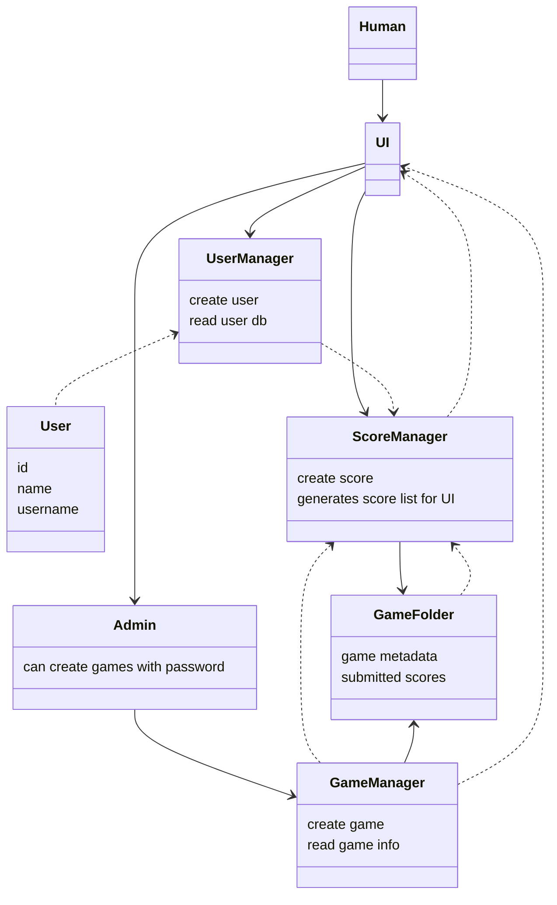

```mermaid
classDiagram
UI-->Admin
Admin --> GameManager
Human-->UI
UI-->UserManager
UserManager <.. User
UI-->ScoreManager
ScoreManager --> GameFolder
ScoreManager ..> UI
GameFolder ..> ScoreManager
UserManager ..> ScoreManager
ScoreManager <.. GameManager
GameFolder <-- GameManager
GameManager ..> UI
class User{
    id
    name
    username
}
class GameFolder{
    game metadata
    submitted scores
}
class UserManager{
    create user
    read user db
}
class GameManager{
    create game
    read game info
}
class Admin{
    can create games with password
}
class ScoreManager{
    create score
    generates score list for UI
}
```