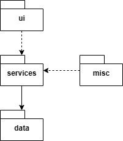
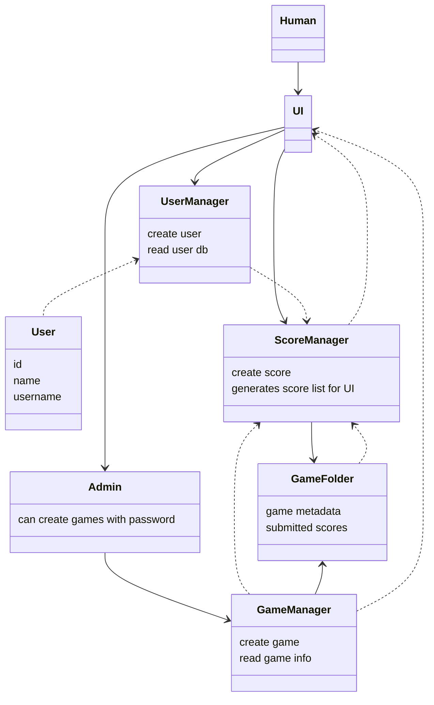
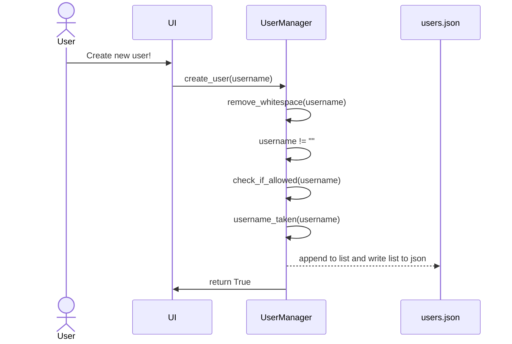
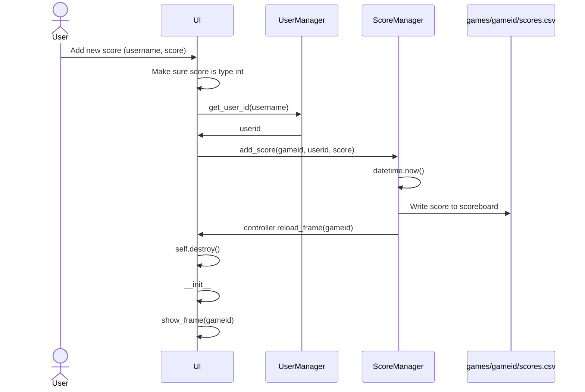
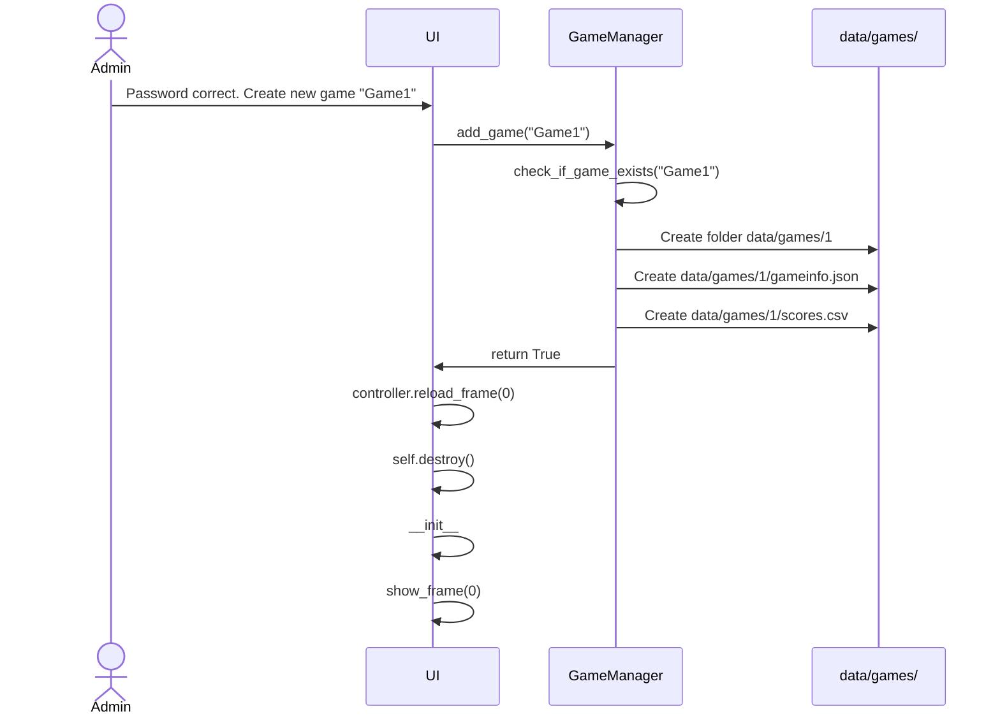

# Arkkitehtuuri

## Rakenne
Ohjelman rakenne näyttää tältä



_ui_ hoitaa käyttöliittymää. _services_ sisältää kaikki sovelluksen dataa käsittelevät moduulit. _data_ on vain pelin data. _misc_ sisältää sovelluksen alustajan ja sovelluksen hakemistotyökalun.

_gen.py_:tä en saanut toimimaan misc hakemistossa. Import virheistä valitti. Siksi se on src:ssä. 

_index.py_ käynnistää sovelluksen.

## Käyttöliittymä

Sovelluksessa on 2 erilaista näkymää, aloitusruutu(Main Menu) ja pelin tuloslista(Scoreboard), jotka on koodattu omaan luokkaansa _ui_ kansiossa.

Käyttöliittymä toimii tkinterin frame-toiminnolla. Se initialisoi main menun ja kaikki scoreboardit frameina heti kun sovellus avataan ja muodostaa niistä listan. Kun on aika vaihtaa näkymää, UI-luokka eli controller, kutsuu tkinterin funktiota tkinter.raise() ja asettaa halutun framen päällimmäiseksi listalta. Pelin ID vastaa listan indeksiä. Main menun indeksi on 0, tämän takia pelien ID:t alkaa 1:stä. Koska sovellus hakee scoreboardien datan initialisoinnin yhteydessä, sovellus on initialisoitava uudestaan, jos halutaan päivittää listan uuden sisällön. Tämän takia sovellus tuhoaa ikkunan tkinter.destroy():lla ja avaa sen uudestaan haluttuun frameen, kun sovellus on päivitettävä(eli kun lisätään uusia pelejä tai tuloksia).

Yritin kaikkeni saada käyttöliittymä toimimaan kurssimateriaalin tavalla, mutta en onnistunut ja menin tällä menetelmällä.

### Pistelistan generoinnista

ScoreManager käyttää funktiota `get_sorted_highscores_list(gameid)` saadakseen listan, jonka tulee näyttää pelin sivulla. Tämä funktio käy kaikki tulokset läpi ja suodataa parhaat järjestyksessä ja palauttaa listan.

## Sovelluslogiikka

Dataa käsittelevä osuus sovelluksesta on jaettu kolmeen vastuualueeseen.
-   _usermgmt_ - Käyttäjädatan käsittely
-   _gamemgmt_ - Pelidatan käsittely
-   _scoremgmt_ - Pelituloksien käsittely

Alla oleva kaavio kuvaa moduulien suhteita.



## Data
Data tallennetaan _src_ hakemistossa sijaitsevaan _data_-hakemistoon. Komento `poetry run invoke setup` valmistelee _data_-hakemiston sovellukselle, joka näyttää tältä:
```
src/data/
├── adminpassword.txt
├── games
├── usernameblacklist.txt
└── users.json
```

_adminpassword.txt_ sisältää salasanan, jolla voi lisätä pelejä sovellukseen käyttöliittymän kautta. Salasanan siis voi vaihtaa.

_users.json_ sisältää kaikki käyttäjät ja heidän datan.

_games_-hakemisto sisältää pelien datan.

_usernameblacklist_ sisältää kielletyt käyttäjänimet. Nimi voidaan kieltää kirjoittamalla sen uudelle riville.


## Päätoiminnallisuudet

### Käyttäjän luominen
Tarkistaa, että käyttäjtunnus vastaa kriteerejä:
-   Alle 16 merkkiä
-   Ei ole aikaisemmin rekisteröity
-   Ei ole whitespacea (poistaa whitespacen automaattisesti)
-   Ei sisällä blacklistillä olevia merkkijonoja

Jos ei täytä kaikkia kriteerejä niin UserManager palauttaa False.



### Tuloksen lisääminen

Käyttäjä lisää tiettyyn peliin oman tuloksensa. Gameid on UI:lla tiedossa jo. Käyttäjä antaa scoren ja käyttäjänimen. Käyttäjänimellä haetaan käyttäjän ID ja lisätään _scores.csv_ tiedostoon formaatissa _käyttäjä-id,aika,tulos_



### Pelin luonti

Pelin luonnin yhteydessä sovellus tarkistaa, onko peliä olemassa. Jos ei, se luo _scores.csv_:n ja _gameinfo.json_:in omaan kansioon jonka nimi perustuu pelin ID:hen. Alla olevassa kaaviossa ID on 1.



## Parannettavaa rakenteesta
Huomasin nopeasti, että olisi voinut hoitaa datan käsittelyn monella eri tavalla yksinkertaisemmin. Pelien ID:hin perustuvan nimeämissääntö on hyvä tässä, mutta olisi varmaan ollut mahdollista saada kaikki pistetaulukkoon liittyvä informaatio yhteen csv:hen tai sqliteen. Sovellus tekee paljon tarpeetonta käyttäjäID:n ja käyttäjänimen välillä tarkistamista. Veikkaan, että käyttäjäID:t eivät loppujen lopuksi ollut niin tarpeellisia.
