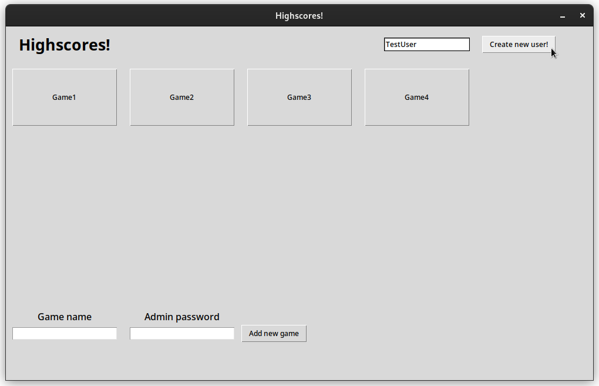
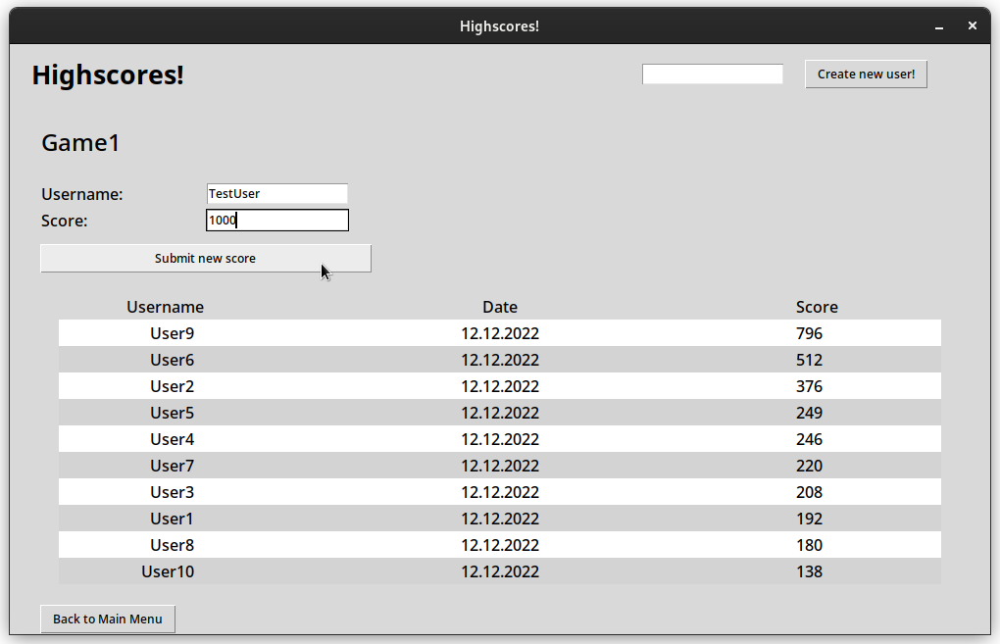
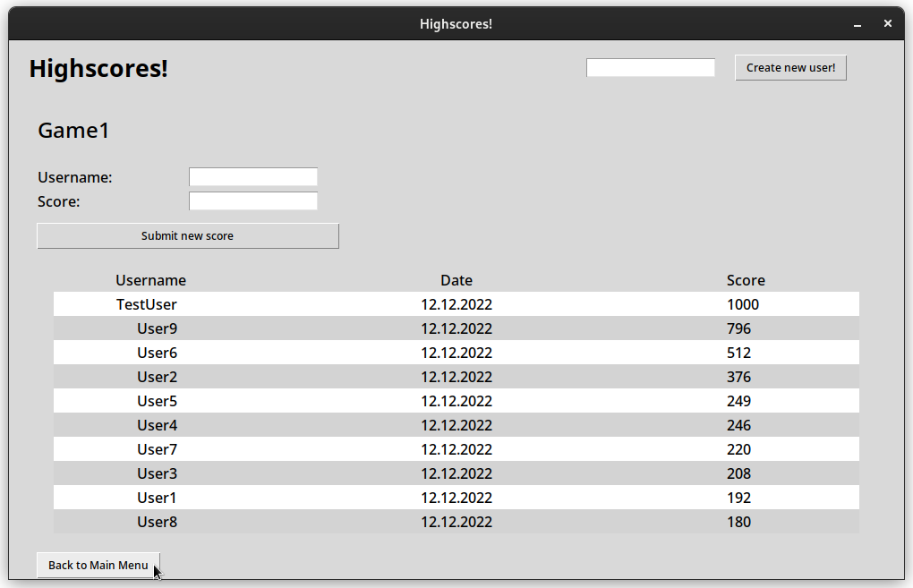
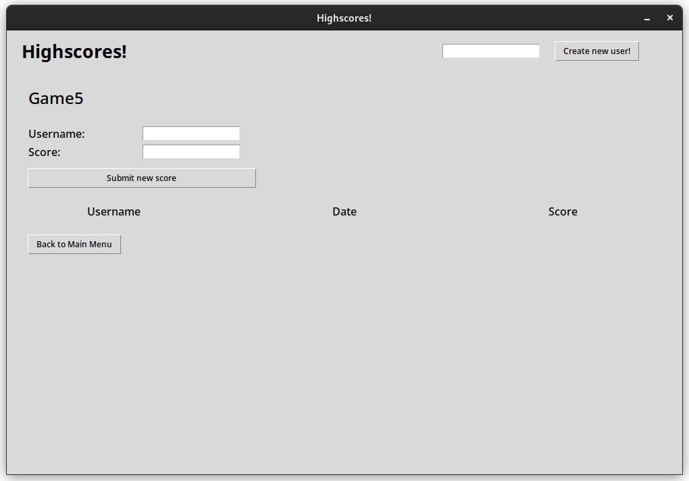

# Käyttöohje

## Asennus
1.   Lataa repositorio koneelle johonkin hakemistoon githubista
2.   Avaa terminaali juurihakemistoon ja lataa riippuvuudet komennolla ```poetry install```
3. Alusta sovellus komennolla ```poetry run invoke setup```
4. (Vaihtoehtoinen) Generoi sovellukseen esimerkkinäkymä komennolla ```poetry run invoke gen```

## Käynnistäminen
Ohjelman voi käynnistää komennolla ```poetry run invoke start```

## Sovelluksen käyttö
Seuraavan näkymän saa aikaan komennolla `poetry run invoke gen`

Kun avaat sovelluksen voit luoda käyttäjätunnuksen kirjoittamalla halutun tunnuksen, ja painamalla `Create new user`-nappia.



Voit luoda uuden pelin admin-salasanalla. Oletus-salasana on `yay`. Voit vaihtaa salasanan muuttamalla `adminpassword.txt`-tiedostoa.


Painamalla jotain peli napeista, voit nähdä peliin lisätyt tulokset eri käyttäjiltä. Voit myös lisätä omalle käyttäjälle tuloksen täyttämällä kentät ja painamalla `Add new score`-nappia.


Ikkuna päivittyy ja tuloksesi tukee näkyviin jos se on tarpeeksi suuri.

Voit palata takaisin aloitusruudulle painamalla `Back to Main Menu` nappia.

Uudessa pelinäkymässä ei ole tuloksia.
