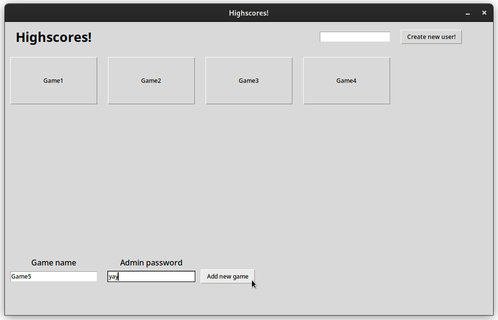

# Käyttöohje

## Asennus
1.   Lataa repositorio koneelle johonkin hakemistoon githubista
2.   Avaa terminaali juurihakemistoon ja lataa riippuvuudet komennolla ```poetry install```
3. Alusta sovellus komennolla ```poetry run invoke setup```
4. (Vaihtoehtoinen) Generoi sovellukseen esimerkkinäkymä komennolla ```poetry run invoke gen```

## Käynnistäminen
Ohjelman voi käynnistää komennolla ```poetry run invoke start```


## Sovelluksen käyttö

Esimerkkinäkymän saa aikaan komennolla `poetry run invoke gen`

### Käyttäjätunnuksen luominen

Kun avaat sovelluksen voit luoda käyttäjätunnuksen kirjoittamalla halutun tunnuksen, ja painamalla `Create new user`-nappia. Käyttäjätunnuksen tulee olla alle 16 merkkiä pitkä ja ei blacklistillä. Jos käyttäjätunnuksesi katoaa tekstikentästä, rekisteröinti onnistui. Painamalla `Create new user`-nappia kun tekstikenttä on tyhjä, terminaali tulostaa listan rekistöityneistä käyttäjistä.


### Pelien luominen

Voit luoda uuden pelin admin-salasanalla. Oletus-salasana on `yay`. Voit vaihtaa salasanan muuttamalla `adminpassword.txt`-tiedostoa. Salasana on ensimmäisellä rivillä oleva teksti. Et voi luoda peliä, jos samanniminen peli on jo aikaisemmin luotu.



### Tuloksen lisääminen

Painamalla jotain peli napeista, voit nähdä peliin lisätyt tulokset eri käyttäjiltä. Voit myös lisätä omalle käyttäjälle tuloksen täyttämällä kentät ja painamalla `Add new score`-nappia.


Ikkuna päivittyy ja tuloksesi tukee näkyviin jos se on tarpeeksi suuri.


### Muuta

Voit palata takaisin aloitusruudulle painamalla `Back to Main Menu` nappia.

Uudessa pelinäkymässä ei ole tuloksia.


Admin voi lisätä blacklistille nimiä muokkaamalla tiedostoa `src/data/usernameblacklist.txt`. Yksi nimi per rivi.