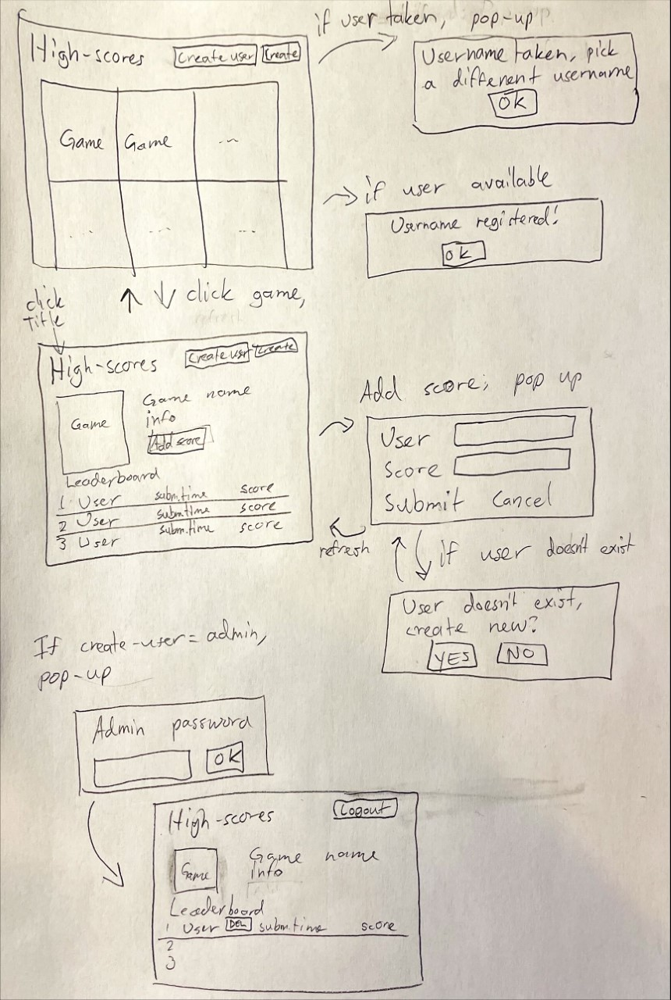

# Highscores!

## Sovelluksen tarkoitus
Olla pienelle yhteisölle (esimerkiksi Matrix Ry) pelistä saatujen piesteiden seuratatyökalu josta näkee 10. parhaat pisteet. Pistetaulukko on suuruusjärjestyksessä. Ohjelmaan voi helposti rekisteröidä uusia käyttäjänimiä(paitsi käyttäjänimeä "admin") ja omia tuloksia. 

## Käyttäjät
-	Käyttäjä✅
	-	Käyttäjä pystyy selailemaan muiden tuloksia eri peleistä✅
	-	Kun valitsee pelin niin submit-score napilla käyttäjä voi lisätä käyttäjälleen tuloksen joka näkyy pistetaulukossa✅
-	Admin✅
	-	Admin voi lisätä uusia pelejä.✅

## Perusversion tarjoama toiminnallisuus
-	Käyttäjän lisäys-toiminto ✅
	-	Jos käyttäjänimeä ei ole aikaisemmin rekisteröity, se luo käyttäjän✅
	-	Jos käyttäjänimi on jo aikaisemmin luotu, se ei luo käyttäjää✅
	-	Whitespacen poisto-toiminto
	-	Admin-käyttäjää ei voi luoda tai jonkinlainen blacklist.
-	Tuloksien lisäys-toiminto ✅
	-	Jos käyttäjänimeä ei ole, se ei lisää tulosta✅
	-	Jos käyttäjälle on rekisteröity jo parempi tulos, sovellus silti näyttää vain käyttäjän parhaimman tuloksen✅
-	Pistetaulun päivittyminen oikeassa järjestyksessä✅
-	Kellonaika näkyville pistetaulukkoon.

## Käyttöliittymäluonnos

## Jatkokehitysideoita
-	Ilmoitustoiminto, joka ilmoittaa käyttäjän toiminnasta
-	Adminille kyky poistaa käyttäjiä
-	Speedrunien kirjausnäkymä ja oma leaderboardi
-	Adminille joku ilmoituslomake
	-	Jos esimerkiksi pitää poistaa käyttäjä tai tulos
-	Osio missä näkyisi viimeisimmät ennätykset koko sovelluksessa
-	Profiilinäkymä, missä näkyisi käyttäjän kaikki tulokset pelikohtaisesti
