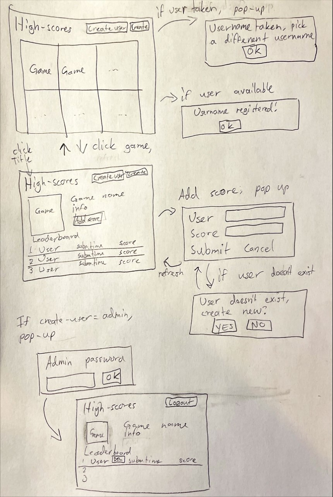

# Highscores!

### Sovelluksen tarkoitus
Olla pienelle yhteisölle (esimerkiksi Matrix Ry) pelistä saatujen piesteiden seuratatyökalu josta näkee kenellä on parhaat pisteet. Pistetaulukko on suuruusjärjestyksessä. Ohjelmaan voi helposti rekisteröidä uusia käyttäjänimiä(paitsi käyttäjänimeä "admin") ja tuloksia. 

### Käyttäjät
-	Käyttäjä
	-	Käyttäjä pystyy selailemaan muiden tuloksia eri peleistä
	-	Kun valitsee pelin niin submit-score napilla käyttäjä voi lisätä käyttäjälleen tuloksen joka näkyy pistetaulukossa
-	Admin
	-	Admin voi poistaa tuloksia jos esimerkiksi joku laittoi typon.

### Käyttöliittymäluonnos

### Perusversion tarjoama toiminnallisuus
-	Käyttäjän lisäys-toiminnon kuuluisi toimia oikein
	-	Jos käyttäjänimeä ei ole aikaisemmin rekisteröity, se ilmoittaa onnistuneesta käyttäjänimen luonnista
	-	Jos käyttäjänimi on jo aikaisemmin luotu, ilmoittaa sovellus käyttäjälle, että valitsee uuden
	-	Käyttäjän rekisteröiminen tuloksen lisäämisen yhteydessä kuuluisi toimia oikein
-	Pistetaulun päivittymisen oikeassa järjestyksessä kuuluisi toimia oikein
-	Adminin poistotoiminnot ja uloskirjautuminen.
	-	Jos kirjautuessa salasana on väärin, niin sovellus palauttaa "kotinäytölle"

### Jatkokehitysideoita
-	Adminille kyky poistaa käyttäjiä(tuloksineen)
-	Speedrunien kirjausnäkymä ja oma leaderboardi
-	Adminille joku ilmoituslomake
-	Osio missä näkyisi viimeisimmät ennätykset
-	Profiilinäkymä, missä näkyisi käyttäjän kaikki tulokset pelikohtaisesti

