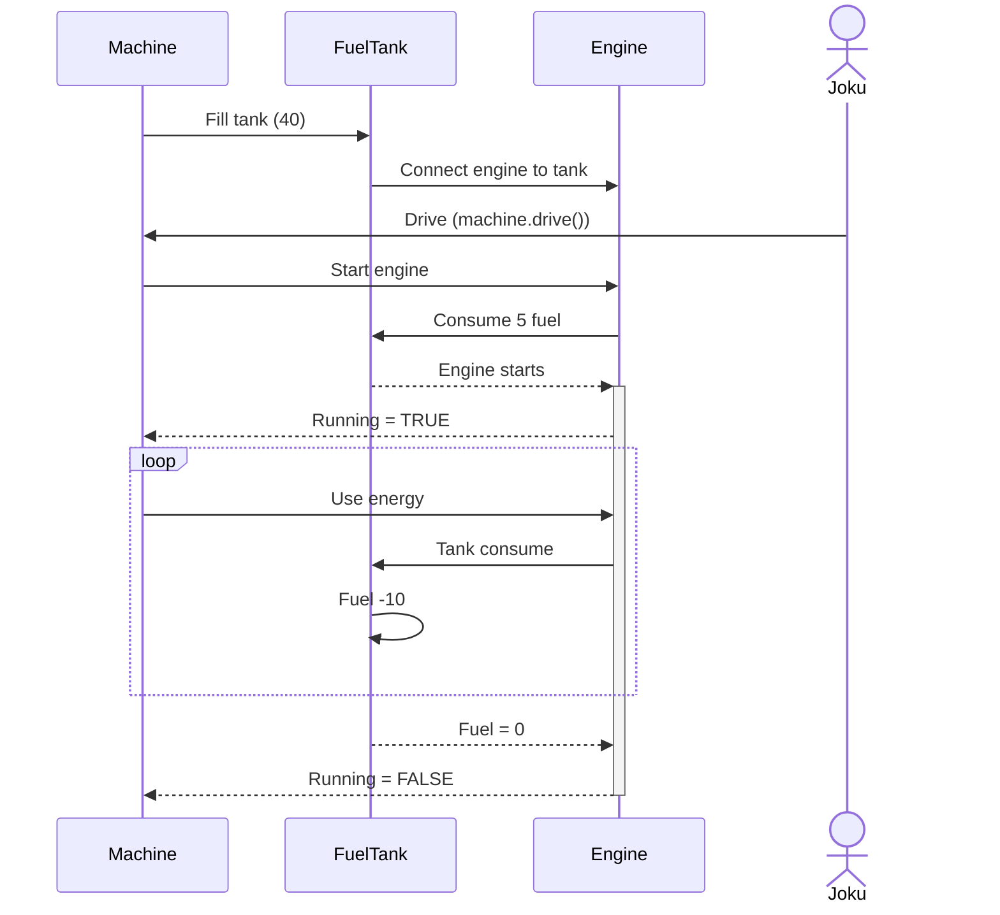
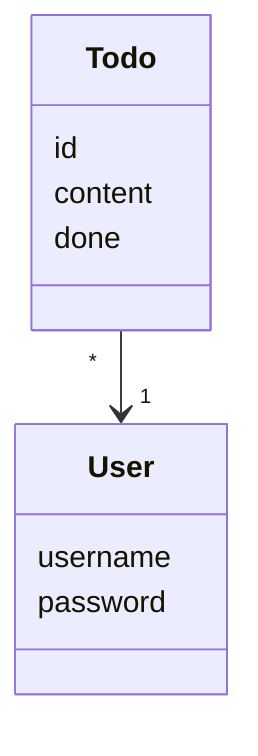

## Noniiin

```mermaid
sequenceDiagram
	Machine->>FuelTank: Fill tank (40)
	FuelTank->>Engine: Connect engine to tank
	actor Joku
	Joku->>Machine: Drive (machine.drive())
	Machine->>Engine: Start engine
	Engine->>FuelTank: Consume 5 fuel
	FuelTank-->>+Engine: Engine starts
	Engine-->>Machine: Running = TRUE
	loop
		Machine->>Engine: Use energy
		Engine->>FuelTank: Tank consume
		FuelTank->>FuelTank: Fuel -10
	end
	FuelTank-->>Engine: Fuel = 0
	Engine-->>-Machine: Running = FALSE
```

```mermaid
 classDiagram
      Todo "*" --> "1" User
      class User{
          username
          password
      }
      class Todo{
          id
          content
          done
      }
```