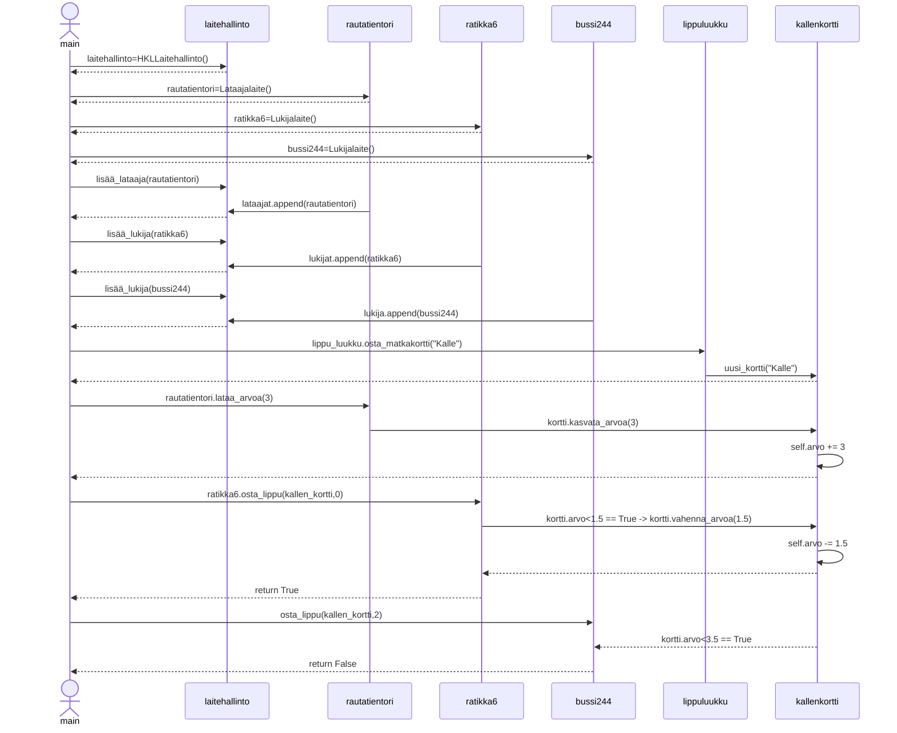

# Laajempi sekvenssikaavio

```mermaid
sequenceDiagram
actor main
main->>laitehallinto:laitehallinto=HKLLaitehallinto()
laitehallinto-->>main: 
main->>rautatientori:rautatientori=Lataajalaite()
rautatientori-->>main: 
main->>ratikka6:ratikka6=Lukijalaite()
ratikka6-->>main: 
main->>bussi244:bussi244=Lukijalaite()
bussi244-->>main: 
main->>laitehallinto: lisää_lataaja(rautatientori)
rautatientori->>laitehallinto: lataajat.append(rautatientori)
laitehallinto-->>main: 
main->>laitehallinto: lisää_lukija(ratikka6)
ratikka6->>laitehallinto: lukijat.append(ratikka6)
laitehallinto-->>main: 
main->>laitehallinto: lisää_lukija(bussi244)
bussi244->>laitehallinto: lukija.append(bussi244)
laitehallinto-->>main: 
main->>lippuluukku: lippu_luukku.osta_matkakortti("Kalle")
lippuluukku->>kallenkortti: uusi_kortti("Kalle")
kallenkortti-->>main: 
main->>rautatientori:rautatientori.lataa_arvoa(3)
rautatientori->>kallenkortti:kortti.kasvata_arvoa(3)
kallenkortti->>kallenkortti: self.arvo += 3
kallenkortti-->>main: 
main->>ratikka6: ratikka6.osta_lippu(kallen_kortti,0)
ratikka6->>kallenkortti: kortti.arvo<1.5 == True -> kortti.vahenna_arvoa(1.5)
kallenkortti->>kallenkortti: self.arvo -= 1.5
kallenkortti-->>ratikka6: 
ratikka6-->>main:return True
main->>bussi244: osta_lippu(kallen_kortti,2)
kallenkortti-->>bussi244: kortti.arvo<3.5 == True 
bussi244-->>main: return False
```